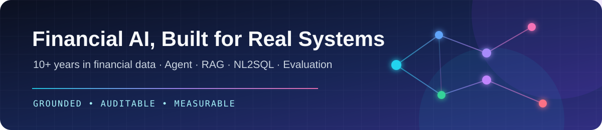

<!-- GitHub Profile README for https://github.com/silasxlx -->

# Silasxlx · Financial AI Application Engineer

<strong>十余年金融数据应用、数据治理与经营分析实践</strong>

专注 AI Agent、RAG、Document Intelligence、NL2SQL 与 LLM Evaluation，把金融知识、复杂文档、指标和业务流程转化为可追溯、可测试、可审计的 AI 系统。

  <a href="https://github.com/silasxlx"><strong>GitHub</strong></a> ·
  <a href="https://blog.csdn.net/weixin_40449129"><strong>CSDN 技术博客</strong></a>

📍 Guangzhou, China · 🎯 Open to AI Agent / LLM Application / RAG opportunities

[30 秒了解我](#30-秒了解我) · [成果与实践](#成果与实践) · [工程项目](#重点工程项目) · [技术写作](#技术写作)

---

## 30 秒了解我

- 🏦 **我是谁**：拥有 10+ 年金融科技实践经验，长期深耕银行数据智能与 AI 应用，具备 数据治理、数据分析、大模型应用及 Agent 系统开发 的完整项目经验，专注企业级 AI 应用落地。
- 🧠 **我擅长**：将领域知识、指标语义、业务数据、规则与工具整合为可执行的 Agent 工作流，构建有依据、可评测、可审计、可人工干预的 RAG、NL2SQL 与智能分析系统。
- 🛠️ **我做过**：主导建设 经营分析智能体、产品知识问答（RAG）、授信智能合规审查（Multi-Agent）、智能营销 Agent 等多个企业级 AI 项目，覆盖经营分析、知识服务、授信审批、精准营销等核心金融场景，实现多项应用上线并产生实际业务价值。
- 🚀 **我的公开项目**：已开源表格感知财报 RAG 系统与可复现经典机器学习实验室；同时持续研发面向银行知识服务、经营分析与合规审查的企业级 AI 应用。

> I build production-minded financial AI applications by connecting models with trusted knowledge, data, tools and business workflows.

## 成果与实践

- 🏆 **数据应用竞赛**：2023–2024 年“阿拉丁”数据应用竞赛一等奖，2025 年二等奖。
- 🏆 **金融科技成果**：2024 年人民银行组织的金融科技进步奖项目三等奖。
- 📄 **智能推荐研究**：研究知识图谱与图神经网络在银行零售推荐中的应用，获金融科技研究项目三等奖，成果发表于《广东金融科技》。
- 📊 **智能报告研究**：围绕企业 BI 实践，研究人机协同生成银行经营分析报告的方法与流程。

## 重点工程项目

> 公开仓库提供源码、架构说明、测试和可复现示例；企业项目实践仅展示脱敏后的方法与能力，不包含雇主或客户数据。
### 01 · [银行产品知识智能问答平台 · Enterprise Practice](https://github.com/silasxlx/creditguard-ai)

面向银行制度、产品手册和操作指引的可追溯 RAG 系统，重点处理条款级知识组织、混合检索、Rerank、引用溯源、失效状态和无依据回答拦截。

`Python` `FastAPI` `LangGraph` `Milvus` `Hybrid Search` `Rerank` `Evaluation`

### 02 · [财报智能问答系统 · Financial Report Intelligent Q&A System](https://github.com/silasxlx/financial-report-rag) 

面向上市公司年度财报的表格感知 RAG 系统，解决长 PDF 解析、复杂财务表格数据丢失、指标错召回和证据页码不准确等问题。

- 支持 MinerU 超过 200 页财报的拆分解析、断点续传与结果合并。
- 将复杂表格保存为通用行、列和 Cell 证据，避免依赖特定表格模板。
- 组合 FAISS、中文 BM25、指标/章节权重与 Qwen 重排。
- 输出 PDF 显示页码、表格 Cell 证据和复合问题完整性检查结果。
- 包含 22 项自动化测试，并通过 GitHub Actions 持续验证。

`Python` `Streamlit` `MinerU` `FAISS` `BM25` `DashScope` `Qwen` `Table-aware RAG`

### 03 · [机器学习 · Classical ML Lab](https://github.com/silasxlx/classical-ml-lab) 

面向经典机器学习算法的离线优先、可复现实验工程，通过统一命令行、确定性数据切分、评估流水线和结构化产物，让模型实验可以重复运行和审计。

`Python` `scikit-learn` `CLI` `Experiment Tracking` `Evaluation` `Testing`

### 04 · 银行经营分析智能体 · Enterprise Practice

连接指标语义层、权限控制、NL2SQL 和分析工作流，让业务问题能够经过查询验证、异常归因和结果溯源，形成结构化分析结论。

`Python` `SQL` `LangGraph` `Qwen Agent` `NL2SQL` `Pandas` `FastAPI`

### 05 · 授信智能合规审查平台 · Enterprise Practice

融合制度检索、确定性规则、工具调用与人工复核：规则引擎负责准入和额度等判断，大模型负责复杂材料理解、异常解释和报告生成。

`LangGraph` `Multi-Agent` `RAG` `Rule Engine` `MCP` `Tool Calling` `Human-in-the-loop`

## 我的工程方法

- **Grounded · 有依据**：结论关联原文、条款、数据或工具结果；证据不足时允许拒答。
- **Controlled · 可控制**：使用显式状态、结构化输出、权限校验、规则约束与人工检查点。
- **Observable · 可观察**：记录检索、工具调用、状态流转、错误、延迟和 Token 消耗。
- **Measurable · 可度量**：使用测试集评估 Recall、MRR、忠实度、准确率、延迟与成本。
- **Recoverable · 可恢复**：为解析、检索、SQL、工具和模型输出设计重试与降级路径。
- **Maintainable · 可维护**：分离规则、Prompt、模型、工具和数据层，支持版本管理与持续演进。

## 技术能力

- **LLM 应用**：RAG、Agent、Multi-Agent、Structured Output、Prompt Engineering、Qwen、DashScope
- **文档智能**：MinerU、长 PDF 解析、复杂表格 Cell 建模、页码与证据追溯
- **数据智能**：Python、SQL、Pandas、指标体系、NL2SQL、机器学习
- **检索与存储**：FAISS、BM25、Hybrid Search、Rerank、Milvus、PostgreSQL、MySQL、Redis
- **服务与交付**：FastAPI、Docker、Linux、REST API、Git、CI/CD
- **质量保障**：Test Set、Retrieval Evaluation、Tracing、Regression Test、Human Review

## 技术写作

我持续记录数据、机器学习和 AI 应用工程实践，重点关注架构取舍、质量评测与失败复盘。

- 📝 [CSDN 技术博客](https://blog.csdn.net/weixin_40449129)
- 🧪 [Classical ML Lab · 当前维护项目](https://github.com/silasxlx/classical-ml-lab)
- 📦 [机器学习博客历史代码 · Archived](https://github.com/silasxlx/machinelearning-blob)

## 当前探索

- Agent Memory、Agentic RAG 与 Corrective RAG
- Table-aware RAG、复杂文档解析与财务指标评测
- MCP、Tool Calling 与企业权限审计
- LLM-as-a-Judge 与 RAG / Agent 回归评测
- 金融知识、指标与规则的统一语义层

---

### Let's build AI systems that work under real-world constraints.

欢迎围绕金融 AI、企业级 RAG、数据智能和 Agent 工程交流与合作。

[GitHub](https://github.com/silasxlx) · [CSDN](https://blog.csdn.net/weixin_40449129)

All public demos use synthetic data and generic business rules. No employer or customer data is included.

